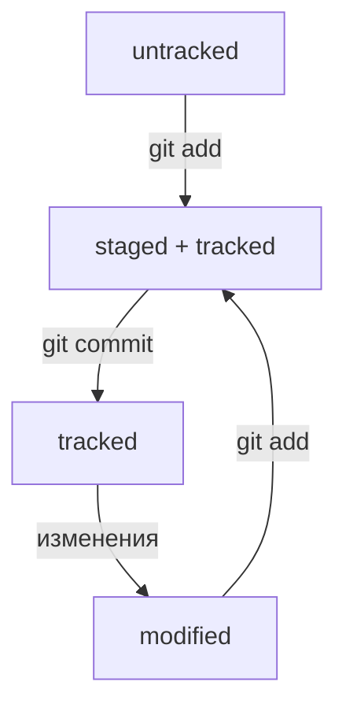

## Java + Git
---

**Чтобы начать работать с Git'ом нужно:**

- Скачать __Git__ для __Windows__ (таков мой путь)  
- Запустить `git-bash.exe`  
- ~~Конец~~  
- Изучить базовые команды для __Linux__, т.к. в `git-bash` будем выполнять команды на __bash__:

  ```bash
  cd        # переход в директорию
  mkdir     # создать директорию
  rm        # удалить файл
  rmdir     # удалить директорию
  touch     # создать файл
  vim       # открыть редактор Vim
  ```

- Так же нужно разобраться в командах, специфичных для __git__:

  ```bash
  git add          # добавить изменения в индекс
  git commit -m "" # зафиксировать изменения с комментарием
  git push         # отправить изменения на сервер
  git clone        # клонировать удалённый репозиторий
  ```

---

Теперь можно зарегистрироваться на __GitHub__:  
- Перейти по [ссылке для регистрации](https://github.com/signup)  
- Создать __SSH__ ключи (для безопасности и удобной работы без пароля)  
- Связать локальный репозиторий `git` с репозиторием на __GitHub__

---

**Это база!!!**  

---
## Погружаемся в Git
---
** Хеш, лог, HEAD **

Хеш - символьная строка преобразованная из надобра данных при коммите 
- Хеш всегда одинаковый для одинакового набора данных
- При любом изменени данных изменится и Хеш

Лог - список коммитов с их описанием, содержит поля:
- Хеш коммита
- Имя автора и его эллектронная почта
- Дата и время создания коммита
- Сообщение к коммиту

HEAD - служебный файл в папке .git в котором отражается информация о последнем коммите
- В файле хранится ссылка, если перейти по ссылке можно увидеть кеш последнего коммита,
- он должен соответствовать выводу git log

** Статусы файлов ** 
Всего статусов 4:
- Untracked
- Staged
- Modified
- Tracked

Untracked - файл имеент такой статус, если репозиторий видит что такой файл существует, но не следит за изменениями в нём. У такого файла нет предыдущих версий.

Staged - файл имеет такой статус, после попадания в staging area, это происходит после выполнения команды git add 

Modified - файл имеет отличия от последней сохранённой версии

Tracked - все файлы в которых git отслеживается изменения. Файлы в состоянии staged и modified так же имею статус tracked 



** Сообщения к коммитам **

Для оформления сообщений к коммитам существует ряд правил, они могут отличаться в зависимости от команды разработки, самые очевидные можно выделить так:
- Сообщение не должно быть длиннее 72 символов
- Сообщение должно давать максимум возможной полезной информации
- Исключать бесполезную информацию

Зачастую в коммитах отображается обозновательный признак задачии описание проделанной работы

Так же существует стандарт Convertional Commits
- формат коммита такой - <type>: <сообщение>
Пример
- git commit -m "feat: добавить подсчёт суммы заказов за неделю"
